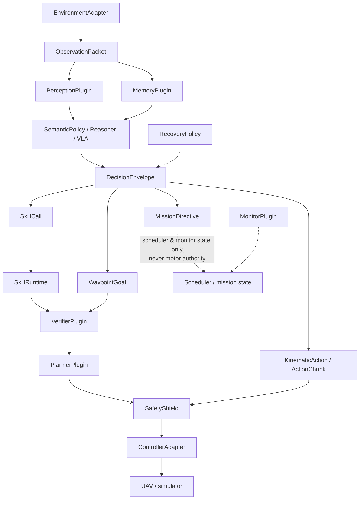
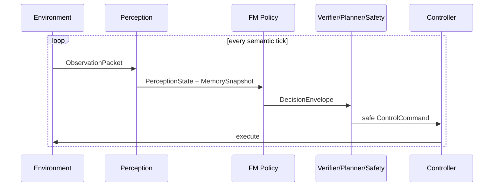
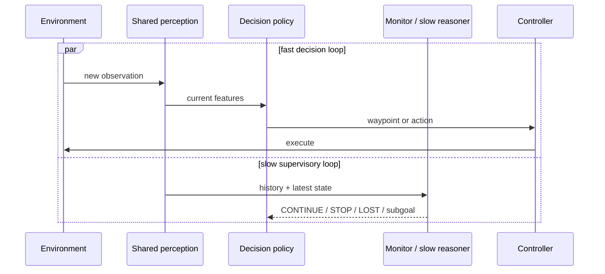
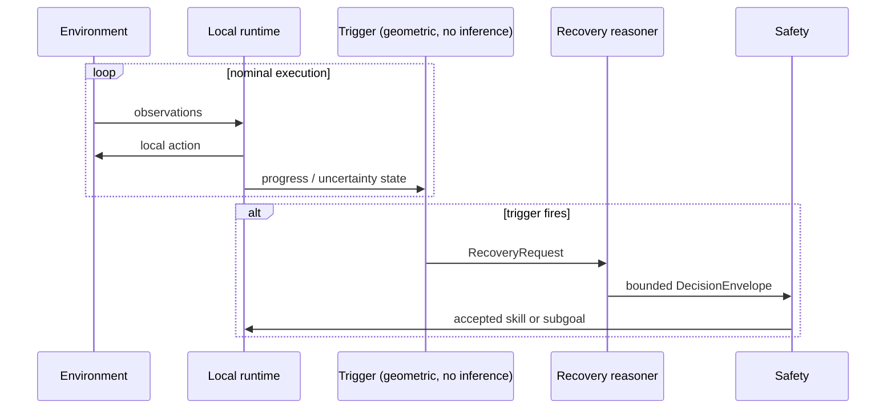
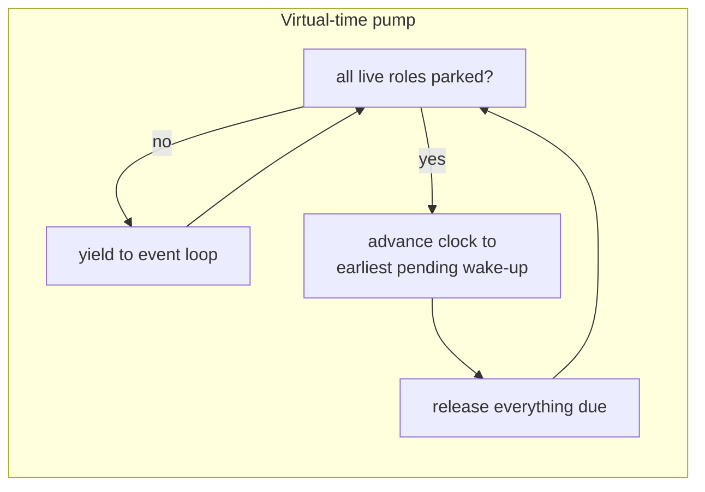

# Runtime architecture

A thin typed kernel with plugin interfaces around it. Nothing in the core
imports a concrete plugin; configs name plugins and the registry resolves them.

## Core data path

The dashed edges are the ones that carry *intent* rather than motion. A monitor
or a slow reasoner can change what the system is trying to do; neither can move
the vehicle.

## The three scheduling modes

Same components in all three. Only the schedule differs — which is exactly what
makes C10 / C12 / C13 a comparison of timing rather than of capability.

### Always-on semantic policy (C1–C3, simple direct VLA)

### Multi-rate dual loop (C4, C5, C12)

The monitor may be a different model, the visual features need not be shared,
and the decision policy need not produce waypoints. That freedom is what makes
this a benchmark runtime rather than a reproduction of one paper.

### Event-triggered recovery (C6, C13)

During nominal execution the reasoner is **absent**, not merely cheap: the log
shows zero calls. The watcher is deliberately geometric and inference-free —
if it were a model call, reasoning would not actually be absent and the compute
saving would be fictional.

## Simulated time

Every concurrently scheduled role registers with the clock and blocks only by
awaiting it. Two failure modes are converted into loud errors rather than silent
wrong answers:

- a role that never parks (awaiting something other than simulation time) trips
  the spin guard;
- pumping with no registered roles raises immediately, instead of hanging.

## Where each experimental axis lives

| Axis | Where it is expressed |
|---|---|
| Authority | `authority` + which policy plugin, enforced by `DecisionRouter` |
| Reasoning schedule | `scheduler.kind`, turned into role schedules by `Scheduler` |
| Safety boundary | presence of `verifier`, `planner`, `shield` |
| Progress/recovery | `monitor` / `recovery` plugins + `scheduler.trigger` |
| Semantic memory | `memory` plugin + `memory_consumers` |
| Action horizon | `action_horizon` + `chunk_length`, consumed by the router |

## Invariants the tests enforce

1. A `mission_directive` never becomes a `ControlCommand`.
2. `ControlCommand` has no free-form text field.
3. Every executed command carries the observation it came from.
4. Staleness is evaluated at execution time, against the architecture's bound.
5. Memory `reset()` restores a pristine plugin — no state crosses episodes.
6. Every key component of the feature-cache key changes the key.
7. Illegal architecture graphs fail before an episode starts, reporting *all*
   violations at once.
8. The planner and the safety shield read clearance through one shared function,
   so they cannot disagree about what "clear" means and livelock.
