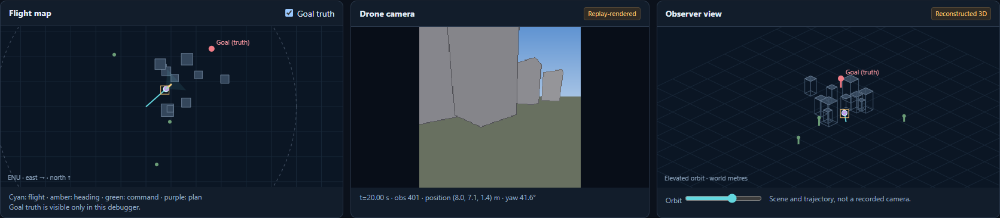
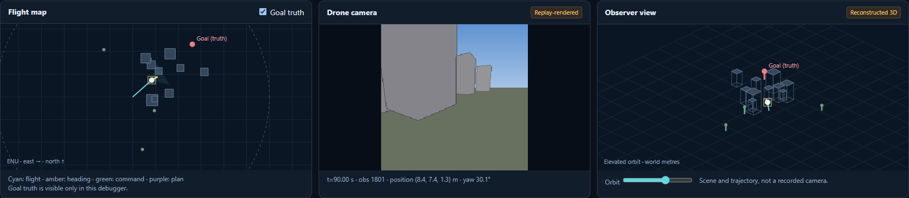

# D-102: adaptive-plan flight and dashboard diagnosis

## Outcome and scope

One new full flight: **vlm_adaptive_plan_20260912_s1061**, Gemma4:e2b, corrected-depth
seed 1061, unchanged D-101 policy/config. Timeout at 90 s, zero collisions, path
11.306 m, final/closest target distance 23.995 m. Position settles within 1 cm of
its final value by 23.75 s. The corrected C5 baseline also timed out, but approached
to 14.940 m before ending at 30.015 m. The new run's better final distance is not
evidence of better search: it stopped making progress substantially earlier.

[Open dashboard](http://127.0.0.1:8765/adaptive_plan_comparison.html#run=vlm_adaptive_plan_20260912_s1061&t=19&decision=08beeb5be664).
The selector includes the actual new flight and corrected historical C5 seed 1061.
No synthetic plan is attached to either flight. Replay matches all 1,800 new poses,
with zero missing decision source frames. The historical cached dashboard data is
checked against its unchanged event-log hash. Source imagery is labeled replay-
rendered; exact encoded model inputs remain in the VLM evidence panel.

## Visual inspection before diagnosis

Watched dashboard playback and captured camera/map/observer views at 0, 10, 20,
30, 40, 50, 70 and 90 s for both flights. Screenshots and the exact selected
decision/source times are in dashboard/OBSERVATIONS.json. Eight snapshots are
inspection samples, not a claim that every camera frame was manually reviewed.

At 10 s the drone approaches the gray structures; by 20 s a gray building fills
most of the image, with open-looking space to the right. At 40 and 90 s its pose
and view are effectively unchanged. The displayed plan continues to target the
nearest structure while its own scene summary admits missing color confirmation.
The apparent opening alone does not establish physical or planner clearance.

## Finding 1: gate and local planner disagree

The first rejection occurs at 19.0 s, decision **08beeb5be664**. Of 89 completed
policy outputs, 71 are rejected by the semantic/geometric verifier; only the first
18 reach SUPER. Rejection means no new trajectory was admitted, not that the drone
collided or that SUPER tried and failed to go around the obstacle.

Replayed controls and gate evaluations in their recorded order through 32 s.
Verified 641 poses, all 32 gate results/reasons, and the metadata of all 18 accepted
SUPER plans. On a separate copy of the historical planner state, passed the exact
rejected goals to SUPER using the same execution-time observations:

| Available time / decision | Original gate | Copied SUPER result |
|---|---|---|
| 19 s / 08beeb5be664 | Rejected | Feasible, entirely known-free path to the exact goal |
| 32 s / e2ed6a90be73 | Rejected | Feasible, entirely known-free path to the exact goal |

Both path endpoints equal the supplied target exactly. Full paths and metadata
are in REJECTION_PROBE.json. This was **planning-only**: no continuation flight,
no model call, no disabled gate in an autonomous run. It establishes disagreement
between acceptance criteria, not physical flight success or proof that removing
the verifier would complete the mission.

The common gate approximates endpoint clearance with the nearest horizontal range
ray and a band of twice min_clearance_m. Its 3.6 m band in this profile differs from
SUPER's occupancy-based feasibility test. Thus the first motor blockage has an
identified admission boundary; the stored flight does not test SUPER on those
rejected destinations. A focused interface correction/ablation is warranted before
attributing this stall to VLM planning quality alone. No clearance parameter was tuned.

## Finding 2: the model does not revise its plan after explicit failures

Exact captures confirm that rejection feedback reaches the next request, matched
to its decision ID. This is not a missing-feedback channel. At the 33 s decision,
for example, INPUT STATE contains the 32 s rejection and its clearance reason.

- All 89 assessments are `uncertain`; the active subgoal remains `s1` throughout.
- The plan changes once at the third decision, then stays at revision 2 for 87 calls.
- All 32 `move` actions choose u=500, v=500, distance=5.
- The last 57 actions choose `retain`, keeping a previously rejected world point.
- The plan treats the nearest structure as a presumed red tower despite admitting
  that the requested color has not been confirmed. This mixes an exploration
  hypothesis with target identity.

The runtime correctly preserves the requested world point, but the contract
currently allows retaining a rejected proposal. That is an architectural weakness
in the failure loop. Retain alone is not the full explanation: repeated rejected
`move` actions precede it. Making retain unavailable could prevent this exact loop
without guaranteeing that the replacement points or semantic plan would improve.

There are 26 distinct encoded policy images across the flight; source frames change
while the drone moves and stabilize when it stops. Requests are not accidentally
fed one immutable initial image. Prompt sizes at the checked late calls are about
2,740 estimated text tokens under an 8,192 context setting; no truncation error was
reported, though this estimate does not prove all multimodal context was used.

Repeated center-image motion also descends because the camera is pitched down.
The SPF transform does what it declares; this observation is not evidence of a
new projection bug. It further shows that valid structured plans did not produce
meaningfully varying spatial actions in this run.

## What is settled, and what remains open

Settled: real Gemma emits valid plans; the dashboard exposes them; early motion
occurs; verifier rejection prevents further admission; feedback is supplied; the
model does not adapt in this run; copied SUPER accepts the two tested goals.

Open: actual physical safety/execution after changing the gate, whether the model
would revise its target after motion resumes, whether explicit accepted/rejected
point state improves recovery, and general performance across architectures/models.
Do not conclude that VLMs cannot plan or that the full MapGPT paper failed. This is
the D-101 component adaptation with different action/verification assumptions.

Next bounded work: use these saved cases to align the waypoint acceptance contract
with shared SUPER feasibility; keep schema/geofence/staleness checks. Separately
make rejected-versus-accepted destination state explicit before testing retain/replan
behavior. Do not combine both changes and call the result a single-cause fix.
No second full flight was spent on an unchanged known-stalling configuration.

## Execution accounting and reproducibility

One successful preflight call (310 tokens, 13.88 s measured latency, 1.0 s simulated
charge), then one full flight with 89 policy and 45 monitor completions, all local
Gemma4:e2b. Flight capture contains 135 requests: 134 complete and one cancelled at
the episode boundary. No cloud calls, other model loads or held-out seeds. Fixed
simulation charge is inherited and must not be read as wall inference latency.

`report_adaptive_plan_flights.py` exports saved controls; `inspect_adaptive_plan_dashboard.py`
operates the dashboard and captures real views/plans; `audit_adaptive_plan_rejections.py`
reconstructs the selected gate/planner boundary. Browser playback and switching work,
with zero JavaScript errors. Direct CUA connection failed; inspection used headless
Edge with dashboard screenshots, not guessed UI state. All four new helper scripts
pass Ruff. No runtime policy, verifier, planner or flight-config changes in D-102.

Harness corrections before valid probes: adapter name extraction, correct CLI module
(`python -m uavlab.cli`, not `python -m uavlab`), and reading the compact logged
`decision_payload` while reconstructing envelopes. These caused no additional model
calls or flights. Failed launcher output is preserved. Images and results are saved;
CHANGES.md and the decision register record the experiment.
