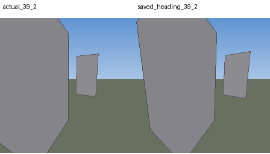

# D-115: Qwen4 gate and one clutter flight

Six new saved-image checks passed. The subsequent clutter flight still timed out.
The image result warrants this diagnostic configuration, not a claim of reliable planning.

| Same environment and seed 1061 | Gemma baseline | Qwen3-VL4B |
|---|---:|---:|
| Outcome | timeout | timeout |
| Closest goal distance | 22.58 m | 13.75 m |
| Final goal distance | 37.91 m | 29.30 m |

Qwen flight: `c5_clutter_qwen4_20260915_s1061`, 90 simulated seconds,
182.94 wall seconds, zero collisions, minimum obstacle distance 1.325 m.
Only the model, digest, host and response channel changed; navigation remained
unchanged. The flight uses the existing point interface, not the image gate's bbox
interface. JSON comes from `thinking`, is parsed and validated normally.
Fixed simulated policy/monitor latency remains 1.0/1.2 s for this comparison;
actual latency is recorded, so this is not a calibrated deployment benchmark.

## What the dashboard establishes

At 25.95 s the actual Qwen source image shows the red target, and its returned
pixel lies on that target. At 33.95 s the target is still visible. Movement then
loses the target. The monitor correctly reports loss and triggers recovery at
37.2 s. This is not a failure to trigger recovery.

Recovery tries to return from -15.850 degrees to the last confirmed heading,
33.758 degrees. It has only 2 seconds including a 0.25 second hold, at a maximum
0.4 rad/s: at most 40.107 degrees for a required 49.608 degree turn. It expires
at 39.2 s, still 10.314 degrees short. Exploration resumes. The loss-episode latch
allows one recovery trigger despite 27 LOST assessments, until valid reacquisition.

**A longer turn alone is not a demonstrated fix.** Offline rendering at the same
39.2 s position with the full saved heading still shows no red target. Translation
has changed the view. Both actual and counterfactual images were visually inspected;
neither contains red pixels. This is an offline view probe, not another flight.

Relevant code: `core/orchestrator.py` LOST branch around 539 and latch reset around
568; `core/decision_router.py` fixed reorientation deadline around 474 and heading
check around 488. The HTML monitor `blocking` field describes scheduling, not
whether physical movement is stopped.

## Next bounded step

Reproduce recovery from the saved loss episode and test the contract: expiry must
not mean successful reacquisition. Track position/view evidence as well as heading.
Distinguish a timing repair from adding viewpoint search or backtracking, which is
an architecture extension. Compare those alternatives offline before changing the
flight profile or spending another inference batch. Do not automatically retry forever.
This episode does not establish the sole cause of the entire navigation failure.

## Verification and evidence

- Six original 224x224 RGB images, frozen criteria, all six JSON replies valid;
  positive IoUs .7704/.9383/.9767, three correct absences. These are six new frames,
  not six independent environments.
- 48 existing adapter/OnFly tests passed. New report/probe tooling lint passed.
- Flight: 134 completed calls (89 policy,45 monitor), one final cancellation,
  no inference errors. Total batch: six image calls plus that one flight.
- Exact replay: 1,800 Qwen poses and all 89 policy images match; both compared
  trajectories total 3,600 matching poses. Both playbacks and 15 dashboard seeks
  checked in Edge with no JavaScript errors.
- Raw 442 speed violations are numerical excess <=1.11e-16 m/s, audited separately.
- `FLIGHT_AUDIT.json`, `RECOVERY_COUNTERFACTUAL.json`, `browser/CHECKS.json`,
  `flight/` preserve results, source captures and compressed events.
- Dedicated 11435 model unloaded and server stopped; shared 11434 untouched.
  Debugger 8766 remains available. No paid/cloud inference.

Dashboard: http://127.0.0.1:8766/qwen4_clutter.html#run=c5_clutter_qwen4_20260915_s1061&t=33.95
