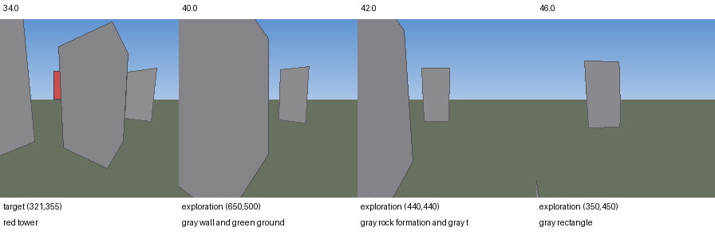

> Historical cycle-1 report. Its pending next actions and automation status are superseded by [the completed batch report](../REPORT.md).

# D-116 cycle 1: handoff repair confirmed, mission still fails

| Metric | D-115 Qwen baseline | Fresh-view handoff |
|---|---:|---:|
| Outcome | timeout90s | timeout90s |
| Closest distance |13.746m|13.401m|
| Final distance |29.295m|29.939m|
| Collisions |0|0|

No navigation improvement is established: closest approach is marginally better,
final distance worse, and target reacquisition still fails. This is one development
seed, not a benchmark conclusion. The repair remains opt-in; no baseline promotion.

## Causal check

Matched controls and poses are identical until39.25s, the first changed command.
Baseline resumes movement then from obs760 (37.95s, during recovery).
The new profile holds through40s; it rejects the delayed obs780 (38.95s) reply
at40s. Motion resumes at41s from obs800 captured39.95s after expiry39.2s.
The fresh-image handoff contract is satisfied. This does not imply reacquisition.
No new target search, timed turn extension or ground-truth route was introduced.

Source images at inference-start34/40/42/46s (captured0.05s earlier) were inspected:
red target in the first; absent in the next three. The fresh policy chooses open
space to the right of the large wall and then continues away without reacquiring.
Dashboard at41s inspected with flight map, drone camera, observer and source timing.
The monitor reports27 LOST, with one bounded recovery trigger, as in the baseline.

Next is offline diagnosis of the information given to the decision VLM. The
`grounded_waypoints` prompt uses the current image and routing feedback; it does
not carry persistent target-loss state or the last-confirmed view. Check this
against the intended architecture contract before naming a temporal-context
ablation. A new VLM memory/recovery mechanism must not be presented as the
original paper implementation. Do not insert a scripted target search or oracle.

## Verification

117 focused tests pass (router,OnFly,fence,inference,hover,target-stop), including
legacy behavior, delayed-reply rejection, fresh resumption and temporal-vs-obstacle
feedback. New tooling lint passes. Source audit now filters rejection events
without source IDs; runtime logs are unchanged. All1800 new poses and89 source
images match; comparison has3600 exact poses. Edge:20 seeks,2 playbacks,no JS errors.
134 completed local Qwen calls plus1 final cancellation; zero inference errors.
427 raw speed violations are floating-point excess only (see cycle1/AUDIT.json).
Dedicated Ollama11435 unloaded/stopped; shared11434 and Valley8765 untouched.

Run `c5_recovery_fresh_20260915_s1061`, runtime commit20eafe0. Frozen configs,
events,source images/model replies,code snapshots and browser checks retained.
Raw evidence is not rewritten. Dashboard:
http://127.0.0.1:8766/recovery_cycle1.html#run=c5_recovery_fresh_20260915_s1061&t=39.25

Automatic follow-ups remain scheduled until16:55UTC. One of four flight slots used;
next cycle starts offline because this did not improve mission completion.

## Subsequent cycle2 completed

See [cycle2/REPORT.md](../cycle2/REPORT.md). VLM-selected return restores the view,
but the flight still times out. Next offline monitor-semantics diagnosis; two
of four model flights used.
