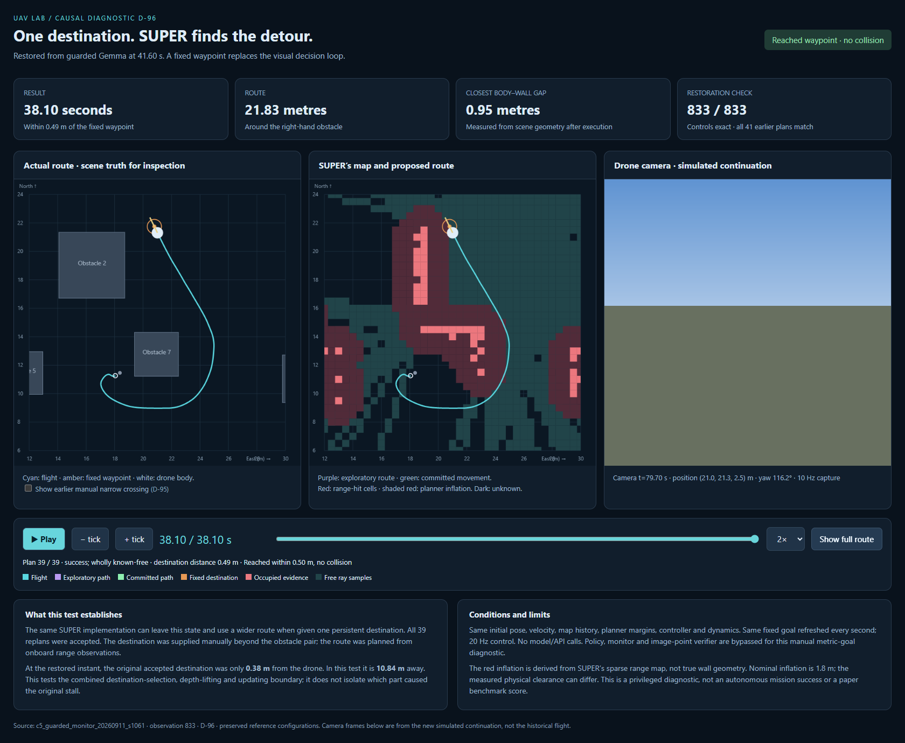

# D-96: fixed-destination SUPER test from 41.60 s

The local stack reached a manually supplied waypoint on the far side of the
obstacle pair in **38.10 seconds**, without collision. It chose a **21.83 m
wide detour around the right obstacle**, rather than the narrow manual crossing.
This is a privileged diagnostic, not an autonomous mission success.

Open [the interactive replay](index.html), or use the running local preview at
[SUPER passage replay](http://127.0.0.1:8765/super_passage_4160.html).
Press Play to see the actual route, SUPER's inferred map and planned paths,
and the simulated camera together. Show full route reveals the completed
trajectory. An optional overlay compares D-95's manual narrow crossing.



## What was held fixed

Source run: `c5_guarded_monitor_20260911_s1061`, development seed 1061.
Restored t=41.60 s / observation 833, position
(18.0505054233, 11.2603843951, 2.4879334073) m, yaw 82.05177 degrees,
velocity (-0.3390547438, -0.2232031216, -0.0147360802) m/s.

Historical controls were replayed in the original simulator. Saved integer
model pixels were lifted with synchronized replay depth, using the original
projection/gate, verifier and router. No policy or inference service was run.
Historical map, guide cells and last commitment were retained, not reset.

- All **833 positions and controls** matched exactly (maximum errors 0).
- All **41 earlier plan metadata records** matched, including point counts,
  feasibility, commitment information and rounded semantic destinations.
- All **41 source image/depth reference digests and lifted depth/gate values**
  matched. These digests identify sensor poses; they are not raw-image hashes.
- Same planner/controller parameters, 0.6 m/s speed cap, 20 Hz control,
  range sensor, dynamics, 0.4 m body radius and 1.8 m nominal planner inflation.
- The diagnostic subclass records paths/maps around original methods; it does
  not modify planning or tracking algorithms.

The frozen code is the testbed's SUPER-derived implementation, with its
range-fan and shared-controller adaptations. This does not evaluate the
published system's original implementation.

## Intervention and stopping rule

One fixed metric waypoint: (20.7940515013, 21.7478134662, 2.4739341311) m,
chosen before execution from the successful D-95 manual endpoint.
Its initial distance is 10.84036 m. Refresh this same intent every second,
matching the historical observed policy availability interval, with fresh
observation provenance and no inference latency. SUPER replans the route;
the diagnostic never supplies a path or ground-truth obstacles to it.

The intervention replaces policy selection, pixel/depth lifting and destination
updates together. The monitor and image-provenance verifier are absent during
continuation because the input is an explicit manual metric waypoint. This is
not a one-factor experiment distinguishing those upstream mechanisms.

Stop at first collision, within 0.50 m of the waypoint, or original t=90 s
(48.4 s maximum continuation). Exactly **one continuation** was executed.
There were **zero model/API calls**. Existing run files and runtime settings
were not modified.

## Observed result

| Measure | Value |
|---|---:|
| Outcome | Reached within waypoint tolerance |
| Elapsed continuation | 38.10 s |
| Final run time | 79.70 s |
| Final waypoint distance | 0.48853 m |
| Travelled distance | 21.83009 m |
| Planning attempts / accepted | 39 / 39 |
| Minimum sampled body-center to wall distance | 1.34934 m |
| Minimum sampled body-to-wall gap | 0.94934 m |
| Collisions | 0 |
| Model calls | 0 |

The drone first retreated and moved right, then passed outside obstacle 7
and approached the fixed destination from the open side. During the detour,
distance to the waypoint initially increased. Continuous immediate distance
reduction would therefore be an unsuitable route verifier criterion here.
The test ends on entering waypoint tolerance; terminal braking/stop behavior
and arrival at the red tower were not tested.

Nominal planner inflation is applied to sparse, quantized range-hit cells.
The range fan already accounts for the body radius. The 1.8 m parameter is
not an exact statement of physical wall clearance; the actual map and its
inflation are separately displayed. No margin was reduced for this test.

## What we can conclude

The local planner/controller can make a useful wider detour from this restored
state when given a persistent destination beyond the obstruction. An additional
route-selection verifier was not necessary for this particular diagnostic.
This does not establish that every image-selected waypoint is valid, that the
VLM is correct or incorrect, or that the original full flight would succeed
with one isolated change.

The original active waypoint at this instant was
(18.3705376984, 11.4587475825, 2.5158253077) m, **0.37755 m from the drone**.
It came from decision `3bec7cd30542`, captured from observation 800 and made
available at 41.0 s, with saved sampled depth 0.213216 m and gated range
0.213180 m. Thus, the executable goal at the selected instant was a nearby
point; target direction in the camera and a persistent navigable destination
are different quantities. Inspect that handoff before selecting a repair.

A useful next diagnostic is to show the selected source pixel, sampled depth,
world waypoint and previous accepted destination together at each replacement
around this bottleneck. Separate waypoint quality from update persistence
before changing either. No additional experiment or inference is scheduled.

## Where a new verifier belongs in the paper

The working design document, `docs/paper - single_uav_experiment_design_short
.docx.pdf`, defines an architecture-level benchmark under fixed observations,
controller, safety constraints and task conditions. `docs/ARCHITECTURE_FAMILIES.md`
already includes adding a verifier as a hybrid architecture axis.

Therefore a new candidate-route verifier/ranker is a legitimate **named
architecture variant**, with its contribution attributed to this project. It
must not silently change the reference reproduction and then credit the cited
paper for the improvement. Keep the same shared execution stack and available
observations, count any extra calls/latency, and compare with/without the new
component on matched development conditions before freezing the final protocol.

Checking whether one proposal is admissible is different from generating and
ranking wider alternative routes. The latter needs a declared objective
(clearance, progress over a horizon, path length, uncertainty), since the
widest route is not necessarily the best route. Current evidence supports
inspecting the waypoint handoff first, rather than adding this component now.
No new verifier or planner variant was implemented in D-96.

## Artifacts and validation

- `trace.json`: all 763 continuation states, 39 map/path snapshots and commands.
- `summary.json`: parameters, exact restoration evidence and outcome.
- `validation.json`: physical/timing checks and browser verification.
- `index.html`: portable replay with all 382 camera frames embedded (10 Hz).
- `initial.png`, `full_route.png`: browser screenshots.
- Camera export files are ignored because their bytes are embedded in the HTML.

Focused script lint passes. Edge playback, seeking, one-tick stepping,
manual-route overlay and camera decoding passed with zero JavaScript errors.
No runtime code changed, so the full model-calling integration suite was not run.

Reproduce from the repository root (PowerShell):

```powershell
$env:PYTHONPATH='src'
python scripts/probe_super_passage_4160.py
python scripts/render_super_passage.py
```

Script checkpoint: `8e8104f`; preregistration: `a197a98`.
