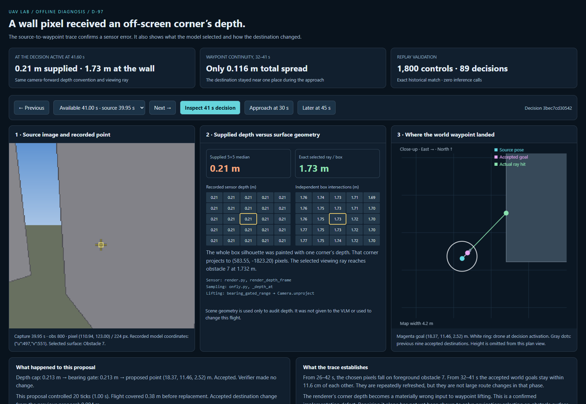

# D-97 — Source image to accepted waypoint: offline audit

**A concrete depth-sensor contract defect is confirmed.** The decision active
at the user's 41.60 s cursor samples a foreground wall pixel. Its depth is
reported as **0.213216 m**, although the same camera ray meets the physical
wall at **1.732390 m**. The renderer painted the nearest positive corner depth
over the entire box silhouette. That corner is nowhere near the selected pixel.

Open [the interactive audit](index.html), or the running
[local audit](http://127.0.0.1:8765/waypoint_handoff.html).
Select the 41 s decision, then compare earlier/later source frames.
The page shows the pixel, both 5x5 depth patches, accepted waypoint, previous
waypoints and replacement timing. The [contact sheet](contact_sheet.png) makes
the changing source views visible together.



## Exact chain at the user's selected moment

The active decision is `3bec7cd30542`:

| Stage | Evidence |
|---|---|
| Original source | t=39.95 s, observation 800 |
| Available to execute | t=41.00 s |
| User's replay cursor | t=41.60 s, observation 833 |
| Recorded model coordinates | u=497, v=551, on the specified 0..999 grid |
| Decoded image pixel | (110.941942, 122.995996), in 224x224 image |
| RGB and drawing ownership | (130,130,136), foreground obstacle 7 |
| Sensor's selected 5x5 median | 0.213216454 m |
| Independent selected-ray wall depth | 1.732390403 m |
| Independent 5x5 ray/box median | 1.731457139 m |
| Bearing-gated depth in saved provenance | 0.213180 m |
| Proposed/accepted world waypoint | (18.3705376984, 11.4587475825, 2.5158253077) m |
| Distance from source pose | 0.214214 m |
| Distance at the user's 41.60 s cursor | 0.377553 m (D-96) |
| Verifier action | Accepted, unmodified |
| New point versus previous accepted point | 0.004196 m |
| Duration of control before replacement | 20 ticks, 1.00 s |

The source image, rather than the later current-camera image, is the correct
image for judging what this decision selected. Both are real observations of
the saved trajectory; the distinction is the 1.05 s decision age at availability.
Raw VLM response text and reasoning were not saved. The displayed integer
coordinates come from logged provenance; no model rationale is inferred.

## Why the supplied depth is wrong

`src/uavlab/adapters/gym/render.py`, `render_depth_frame`, projects each box's
corners, keeps those beyond the near plane, constructs the visible hull, then
fills that entire hull with `min(depths[keep])`. That is a box-level lower bound,
not calibrated per-pixel surface depth as the function's interface describes.
The policy then treats this number as the selected pixel's camera-forward depth.

At observation 800 the contributing corner is
(19.3998502004, 11.2208306640, 6.1792250041) m. It projects to image coordinates
(583.554857, -1823.201632), far outside the 224x224 source image. Its positive
camera-forward depth of 0.213216 m nevertheless fills the wall pixel at
(110.941942, 122.995996).

Independent slab intersection of the selected camera ray with the scene boxes
finds obstacle 7 at 1.732390 m. This is the **same camera-forward convention**,
not a comparison of forward depth with Euclidean distance. All 25 sensor patch
values are 0.213216 m, whereas the geometric patch varies around 1.73 m.
Thus patch median filtering, the 7 m cap and rounding are not responsible for
this discrepancy. The bearing gate changes 0.213216 to only 0.213180 m.
The error is already present before lifting and verification.

The earliest selected-box depth mismatch found in this flight is available at
18 s (source 16.95 s): 6.059681 m supplied versus 6.926013 m along the selected
ray, on obstacle 0. This is an earliest **box-depth** mismatch, not a claim that
all earlier sensor/semantic behavior is correct. In the disputed obstacle-7
approach, depth differs by 26 s; the 7 m policy cap masks the difference until
30 s, when supplied depth becomes 6.615200 m while geometric depth is 7.480275 m.

## What the source images and replacements show

- From availability 26 through 42 s, selected pixels fall on foreground
  obstacle 7. This is visually inspectable and confirmed by raster ownership.
  It does not reveal why the model selected them: target confusion, continuity
  cues and route intent cannot be distinguished from missing raw reasoning.
- From 32 through 41 s, all ten accepted destinations lie within a maximum
  pairwise separation of **0.116146 m**. They cluster near
  (18.4, 11.5, 2.5), in front of the obstacle. Every replacement was accepted
  and none of these points was repaired by the verifier.
- New commands arrive every second, but large destination changes do **not**
  explain this part of the stall. There is no evidence here of a distant,
  useful destination repeatedly being canceled in that interval. This narrows
  the persistence hypothesis raised after D-96; it does not prove that a
  different replan schedule would have no effect.
- After 42 s, destinations begin changing by metres. The maximum adjacent
  accepted-goal change from 43–50 s is **4.566870 m**. At 45 and 50 s, points
  selected on rendered ground have missing depth, trigger the 7 m fallback,
  and require altitude repair. These are later observations, not proof of the
  cause of the earlier near-constant destination.

D-96's manually fixed destination was both **different** and **farther away**.
Its success cannot be attributed to persistence alone. It demonstrated that
SUPER could take a wider route to that useful goal; D-97 explains why the
original flow did not supply that kind of goal at the selected moment.

## Conclusion and next bounded change

Confirmed: the observation depth contract is broken at selected obstacle
pixels, and this materially corrupts the lifted waypoint. Also observed:
foreground-object selection and later goal switching. Not established:
that repairing depth alone solves navigation, or that the VLM is exonerated
or is the sole cause.

The next targeted implementation change should correct box surface depth per
pixel, with geometric regression cases covering a pitched camera near a wall,
off-screen corners, occlusion and near-plane clipping. Preserve the historical
renderer/version for exact old-run replay; use an explicitly identified corrected
sensor configuration for subsequent comparisons. This is a shared sensor fix,
not a new semantic architecture or a route-verifier contribution.

First validate the corrected depth and lifted waypoint on these same saved
source poses/pixels. Corrected depth still points toward the selected wall;
do not expect it by itself to choose an opening. Only after that evidence should
a bounded navigation comparison test whether behavior improves. No new model
call, route verifier or navigation fix was run/implemented in this audit.

## Validation and reproducibility

- Exact replay: **1,800 / 1,800** positions and controls, maximum errors zero.
- **89 / 89** historical plan metadata records and source projections match.
- Reconstructed depth drawing ownership matches **89 / 89 full source depth
  images bit-for-bit**, not just one depth sample.
- Independent ray checker passes four analytical hit/miss cases.
- All **46 finite selected-ray box hits** lie on the expected box surface and
  project back to the original pixel/depth; maximum round-trip error
  2.56e-13. Geometry is diagnostic truth only, never a runtime input here.
- `tests/unit/test_camera_geometry.py`: **2 passed**.
- Diagnostic/export script lint passes.
- Edge page checks: source timestamp, displayed 0.21/1.73 m values, both 25-cell
  patches, approach/late presets, next/previous and repaired-goal display pass;
  zero JavaScript errors.

Evidence is in `trace.json`, `validation.json`, `browser_validation.json`,
`frames/` (89 PNGs and lossless compressed depth arrays), `contact_sheet.png`,
`browser_41.png` and portable `index.html`. Scene truth is confined to this
report/audit and must not appear as policy input in paper results.
Reference digests in old logs identify sensor poses, not raw image hashes.

From the repository root in PowerShell:

```powershell
$env:PYTHONPATH='src'
python scripts/audit_waypoint_handoff.py
python scripts/render_waypoint_handoff.py
python -m pytest tests/unit/test_camera_geometry.py -q
```

Preregistration: `95719e8`. Audit script checkpoint: `0e3c9d4`.
